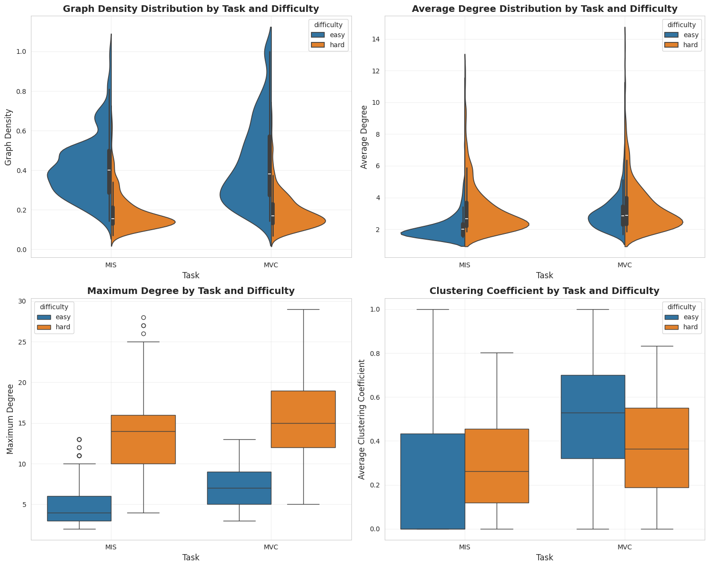
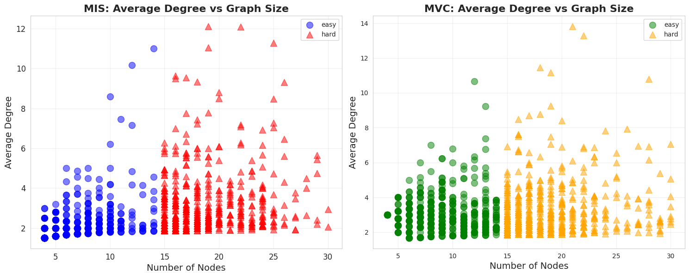
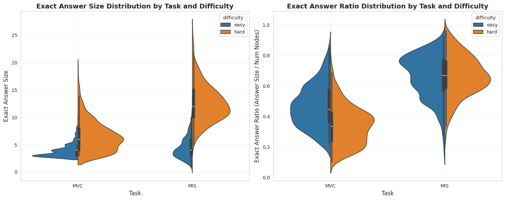

# EDA- report
## Marcin Kapiszewski [156048], Adam Tomys [156057], Marcel Rojewski [156059]

The dataset consists of 2,000 graph problems evenly split between MIS and MVC tasks, with 500 easy and 500 hard instances each. Graph sizes range from 4–14 nodes for easy and 15–30 for hard problems. All graphs are fully connected. MIS graphs are slightly smaller and sparser than MVC ones, with average densities of 0.299 vs. 0.314 and average degrees of 2.71 vs. 3.22. Clustering is notably higher in MVC graphs (0.436) compared to MIS (0.259). Hard problems show a clear scale-up in graph size and complexity—node counts nearly triple for MIS and more than double for MVC—indicating increased difficulty with larger and denser structures.