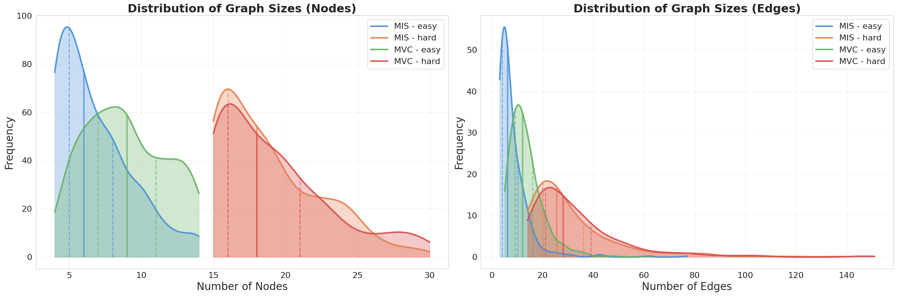
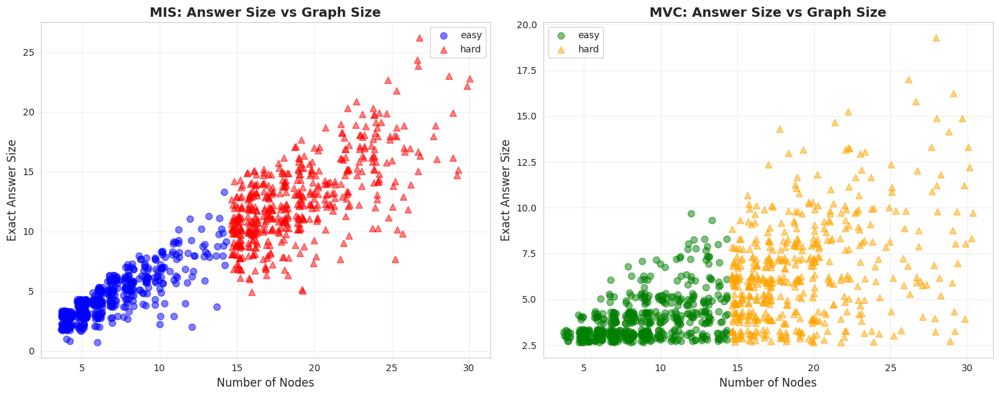
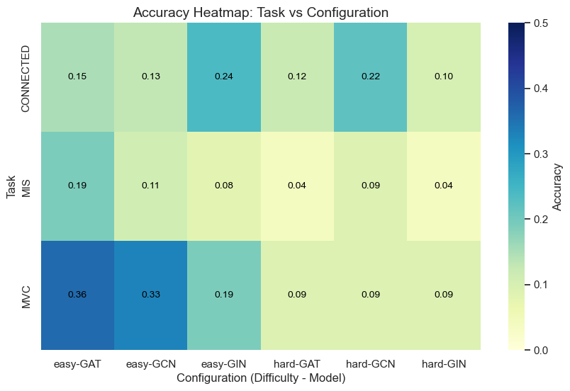
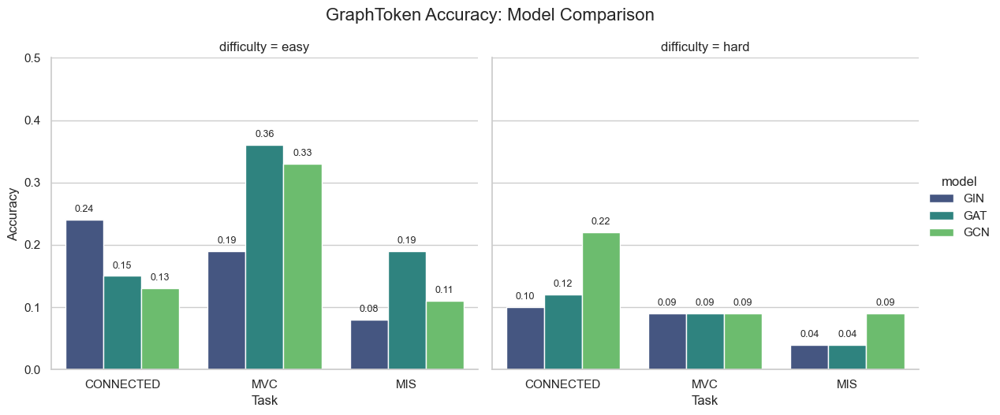
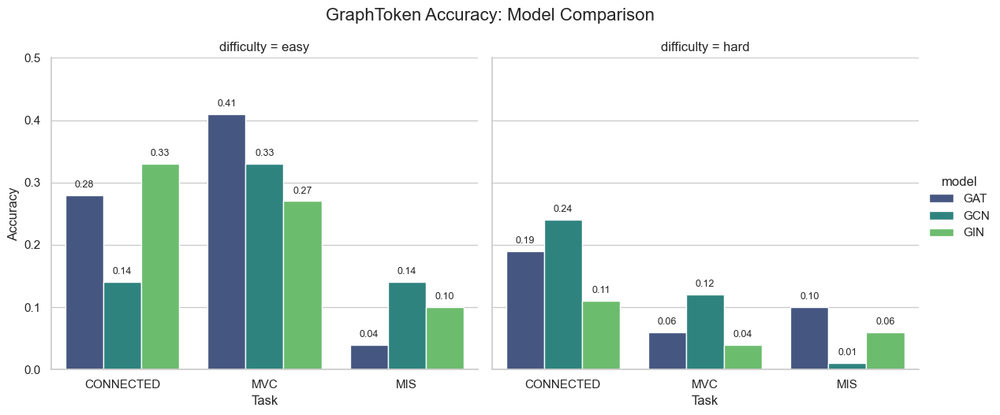

# Evaluation of GraphToken Performance on NP-Complete Problems

**Authors:** Marcin Kapiszewski, Adam Tomys, Marcel Rojewski 

---

## 1. Introduction

The primary objective of this project is to evaluate the efficacy of Large Language Models (LLMs) in solving NP-hard problems, specifically Maximum Vertex Cover (MVC) and Maximum Independent Set (MIS). While the original GraphToken paper demonstrated high proficiency (~95% accuracy) on polynomial-time tasks like connectivity using massive proprietary models (e.g., PaLM 2), the capability of LLMs to tackle NP-complete reasoning remains an under-explored frontier.

To investigate this, we replicate the GraphToken framework using a locally hosted, open-source backbone (Gemma-4B). This local deployment is not merely a constraint but a necessity: the GraphToken methodology relies on direct token manipulation to inject learned "GraphTokens" into the LLM's embedding space—a mechanism generally inaccessible via commercial APIs. By testing on local infrastructure, we aim to determine if smaller, accessible models can generalize to complex graph structures or if they suffer from the reasoning gaps observed in benchmarks like GraphArena.

## 2. Related Work

The integration of Large Language Models (LLMs) with graph-structured data has emerged as a critical area of research, driven by the desire to extend the reasoning capabilities of LLMs to topological and relational domains. However, recent empirical studies have consistently demonstrated that standard LLMs face significant difficulties when processing graphs presented purely as natural language descriptions. Benchmarks such as "Can Language Models Solve Graph Problems in Natural Language?" and "GPT4Graph"  reveal that while LLMs possess vast semantic knowledge, they struggle with structural reasoning tasks when relying solely on textual inputs. These studies highlight that performance is often inconsistent and heavily dependent on prompt variation and input length, which limits the practical applicability of pure language approaches for complex graph tasks. Similarly, explorations into using LLMs to refine text-based graph descriptions before processing have further confirmed the high sensitivity of these models to prompt engineering, often without resolving the underlying reasoning gap.

To mitigate these limitations, recent frameworks have moved towards hybrid architectures that combine the structural processing strengths of Graph Neural Networks (GNNs) with the semantic reasoning of LLMs. A prominent example is the "GraphToken" framework, which serves as the foundational basis for this work. This approach addresses the computational expense of fine-tuning by freezing the LLM parameters and introducing a separate, trainable neural network that functions as a "GraphToken Encoder". By projecting graph features directly into the LLM's embedding space, this method circumvents the inefficiencies of textual graph serialization.

Parallel research has explored alternative methods for this neuro-symbolic integration. "GraphLLM" proposes an end-to-end graph transformer system that generates graph-enhanced prefixes, which are then injected into the keys and values of the LLM's attention layers to boost reasoning abilities. Another significant contribution is "GraphGPT," which employs a dual-stage instruction tuning strategy to align graph and text modalities, specifically aiming to enhance generalization in tasks such as node classification. Furthermore, the study "Can GNN be Good Adapter for LLMs?" investigates the utility of GNNs as adapters that inject structural knowledge into frozen LLMs. While conceptually similar to the GraphToken approach, this work primarily targets node classification tasks rather than the broader, algorithmic graph reasoning problems (such as NP-complete tasks) that are the focus of our research. Collectively, this body of work underscores a decisive shift away from pure text-based prompting toward parameter-efficient, hybrid architectures that explicitly encode structural information.

## 3. Dataset Description

The experimental evaluation relies on a dataset comprising **2,000 graph instances**, systematically categorized to assess model performance across varying levels of complexity and task types. The dataset is equally divided between two NP-complete problems: **Maximum Independent Set (MIS)** and **Minimum Vertex Cover (MVC)**. Each problem category is further stratified into "Easy" and "Hard" subsets, containing 500 instances each, to facilitate a granular analysis of scalability and reasoning capabilities.

### 3.1 Graph Statistics and Complexity

The structural properties of the graphs exhibit distinct characteristics across the difficulty splits. As detailed in Table 1, "Easy" instances typically consist of small-scale graphs with 4 to 14 nodes, whereas "Hard" instances range from 15 to 30 nodes. This increase in size is accompanied by a shift in topological features. For instance, while the average node count triples from the easy to hard setting, the graph density decreases significantly—dropping from approximately 0.41 to 0.19 for MIS tasks. This suggests that the "Hard" instances are not merely larger but also topologically distinct, potentially requiring different reasoning strategies.

**Table 1: Summary of Graph Statistics (Mean ± Std. Dev.)**

| Task | Difficulty | Nodes | Edges | Density | Clustering Coeff. | Diameter |
| :--- | :--- | :--- | :--- | :--- | :--- | :--- |
| **MIS** | Easy | $6.80 \pm 2.57$ | $7.88 \pm 6.67$ | $0.41 \pm 0.16$ | $0.23 \pm 0.28$ | $2.46 \pm 0.78$ |
| **MIS** | Hard | $18.87 \pm 3.50$ | $31.11 \pm 18.06$ | $0.19 \pm 0.09$ | $0.29 \pm 0.21$ | $3.61 \pm 1.33$ |
| **MVC** | Easy | $8.94 \pm 2.80$ | $13.62 \pm 7.17$ | $0.44 \pm 0.22$ | $0.50 \pm 0.27$ | $2.60 \pm 0.90$ |
| **MVC** | Hard | $19.23 \pm 3.91$ | $33.07 \pm 18.69$ | $0.19 \pm 0.09$ | $0.37 \pm 0.22$ | $3.07 \pm 1.11$ |

The distinction between the two problem types is also evident in their clustering coefficients. MVC graphs consistently exhibit higher clustering coefficients compared to MIS graphs (e.g., 0.50 vs. 0.23 in the easy setting), indicating a higher prevalence of local triangles. This structural difference aligns with the nature of the tasks, where vertex covers are often larger and more interconnected than independent sets.

### 3.2 Solution Space Characteristics

An analysis of the exact solution sizes reveals a linear scaling relationship with graph size, particularly for the MIS task. As shown in the distribution analysis, the average size of the Maximum Independent Set increases from $4.50$ in easy graphs to $12.57$ in hard graphs. In contrast, the Minimum Vertex Cover size grows more modestly from $3.92$ to $6.53$. This disparity in solution scaling implies that as problem complexity increases, the output space for MIS expands more rapidly, potentially posing a greater challenge for sequence generation models that must output longer token strings.

All graphs in the dataset are fully connected, ensuring that the tasks require global reasoning rather than being decomposable into disjoint sub-problems. The consistent connectivity (100% across all subsets) eliminates trivial cases and ensures that the evaluation focuses strictly on the NP-hard core of the problems.

## 4. Method Description

Our approach builds upon the **GraphToken** framework, a parameter-efficient method for enabling Large Language Models (LLMs) to reason about graph structures. Unlike standard prompting techniques that rely on verbose textual descriptions of graphs (e.g., edge lists), GraphToken injects structural information directly into the LLM's embedding space via a learned continuous vector. This allows the model to perceive the graph as a distinct semantic token, bridging the modality gap between topological data and natural language.

### 4.1 Architecture

The architecture consists of two primary components: a trainable **Graph Encoder** and a frozen **LLM Backbone**.

1.  **Graph Encoder:**
    The input graph $G = (V, E)$ is first processed by a Graph Neural Network (GNN) to extract structural features. To capture both local connectivity and global topology. These features are then refined through multiple GNN layers. We investigate three distinct architectures to determine the optimal inductive bias for NP-hard problems:
    *   **Graph Isomorphism Network (GIN):** Chosen for its theoretical power in distinguishing non-isomorphic substructures.
    *   **Graph Attention Network (GAT):** Utilized to learn weighted importance of neighbors, potentially useful for identifying critical nodes in vertex covers.
    *   **Graph Convolutional Network (GCN):** A standard baseline for spectral-based convolution.

    The node embeddings are aggregated via a global pooling operation (mean pooling) to produce a fixed-size graph representation.

2.  **Token Projection and Injection:**
    A linear projection layer maps the graph embedding $h_G$ to the dimension of the LLM's token embeddings $d_{llm}$. This projected vector, denoted as the "GraphToken," replaces a designated placeholder token (`<graph>`) in the input sequence.
    
    Formally, given a text prompt $T = (t_1, \dots, t_{<i>}, \dots, t_n)$ where $t_{<i>}$ is the placeholder, the input embedding sequence $E$ becomes:
    $$ E = (\text{Embed}(t_1), \dots, \text{Project}(h_G), \dots, \text{Embed}(t_n)) $$
    
    This sequence is then fed into the LLM, which treats the graph embedding indistinguishably from standard text tokens.

3.  **LLM Backbone:**
    We employ the **Gemma** family of open-weights models (specifically the Gemma-4B variant) as the reasoning core. While initial experiments considered larger models and quantization, we found that the 4B model offered the most stable training dynamics for this specific architecture without the loss of precision associated with aggressive quantization.

### 4.2 Training Methodology

The training process focuses exclusively on aligning the graph representation with the LLM's semantic space.

*   **Objective Function:** The model is trained using the standard Causal Language Modeling (CLM) loss. We maximize the likelihood of the target answer tokens $Y$ given the graph-enhanced prompt:
    $$ \mathcal{L} = -\sum_{j} \log P(y_j | y_{<j}, T, G; \theta_{GNN}, \theta_{Proj}) $$
    Crucially, the parameters of the LLM are **frozen** throughout training. Gradients are backpropagated only through the projection layer and the GNN encoder.

*   **Optimization:**
    Initial experiments with the AdamW optimizer showed slow convergence and instability. To address this, we adopted the **Lion** (EvoLved Sign Momentum) optimizer, which proved more memory-efficient and effective for this specific modality alignment task.
    
*   **Regularization:**
    We implemented an **Early Stopping** mechanism based on validation loss to prevent overfitting, with a patience of 20 epochs. This was critical given the relatively small size of the dataset (2,000 samples) compared to the capacity of the models. The maximum number of epochs was set to 100.

## 5. Evaluation Strategy

To rigorously assess the model's reasoning capabilities, we conduct evaluations across three distinct graph tasks: **Connectivity**, **Maximum Vertex Cover (MVC)**, and **Maximum Independent Set (MIS)**. Connectivity serves as a baseline check for basic topological understanding, while MVC and MIS represent the core NP-complete challenges. The primary performance metric is **exact match accuracy**, where a generated solution is considered correct only if it strictly satisfies the problem constraints (e.g., forming a valid vertex cover of minimum size).

Our experimental design benchmarks the proposed local implementation against two reference points: the high-performance results reported in the original GraphToken study (approximately 95% accuracy on connectivity tasks) and standard random baselines. To isolate the impact of architectural choices and problem complexity, we stratify the analysis by difficulty level ("Easy" vs. "Hard") and GNN backbone (GIN, GAT, and GCN). This multi-faceted evaluation framework allows us to identify specific failure modes and determine whether the limitations stem from the graph encoder's expressivity or the LLM's reasoning capacity.

Based on your current results, the original paper's findings, and the GraphArena benchmark analysis, here is the revised **Outcomes and Conclusions** section. It is formatted as a formal scientific report, utilizing prose and tables instead of bullet points, with designated placeholders for your upcoming Milestone 5 figures.

***

## 6. Outcomes and Conclusions

### 6.1. Performance Analysis and Baseline Comparison (Milestone 4)
The initial evaluation of the GraphToken framework utilizing the Gemma-4B backbone reveals a distinct performance profile that diverges from the original study but aligns closely with contemporary benchmarks for small-scale language models. While the original GraphToken implementation using PaLM-2 reported accuracy metrics exceeding 95% for connectivity tasks, our replication with a smaller local model achieved a peak accuracy of approximately 36% on "Easy" tasks.

This performance gap is consistent with findings from the GraphArena benchmark, which demonstrates that models in the 7B-8B parameter class (such as Llama3-8b) typically achieve significantly lower accuracy on graph computational problems compared to closed-source giants like GPT-4 or PaLM-2 . Specifically, our GIN-based configuration achieved 24% accuracy on connectivity tasks, mirroring the ~28% baseline established by GraphArena for similar model architectures on polynomial-time problems.

The experiments also highlighted a "No Free Lunch" dynamic regarding encoder selection. Contrary to the expectation that GIN would consistently provide superior structural discrimination, attention-based mechanisms (GAT) outperformed GIN on the Maximum Vertex Cover (MVC) task (36% vs. 19%). This aligns with observations in the original literature suggesting that different encoders possess distinct inductive biases suitable for different reasoning types. Table 1 summarizes the performance variance across architectures for the "Easy" dataset partition.

**Table 1: Milestone 4 Accuracy by Task and Architecture (Easy Dataset)**

| Task Type | Task Name | GIN | GAT | GCN | Top Architecture |
| :--- | :--- | :--- | :--- | :--- | :--- |
| **Polynomial** | Connectivity | 0.24 | 0.15 | 0.13 | GIN |
| **NP-Complete** | Max Vertex Cover (MVC) | 0.19 | 0.36 | 0.33 | GAT |
| **NP-Complete** | Max Independent Set (MIS) | 0.08 | 0.19 | 0.11 | GAT |

*Figure 1: Milestone 4 Accuracy Heatmap. Visualizing the accuracy of GIN, GAT, and GCN architectures across Connected, MIS, and MVC tasks. The gradient intensity highlights that GAT performs best on NP-hard tasks (MVC/MIS) while GIN excels at connectivity.*

### 6.2. The Complexity Gap and Hallucination
A critical finding during this phase was the sharp degradation in performance as graph complexity increased. When transitioning from "Easy" graphs (4-14 nodes) to "Hard" graphs (15-30 nodes), accuracy dropped precipitously across all architectures. For instance, the accuracy for the "Connected" task fell from 24% to 10%, and performance on NP-complete tasks hovered near random baselines (~9% for MVC).

On larger graphs, the frozen LLM struggled to maintain long-range dependencies required for algorithmic reasoning. This indicates that the embedding capacity of the current 4B parameter backbone is saturated by the structural complexity of larger graphs.

*Figure 2: Milestone 4 Complexity Gap. A scatter plot illustrating the performance drop-off from Easy (Green markers) to Hard (Red markers) tasks. The visualization quantifies the "Complexity Gap," showing that while models possess some reasoning capability on small graphs, they fail to generalize to larger instances.*

### 6.3. Optimization and Enhanced Training (Milestone 5)
To address the convergence issues and reasoning gaps identified in the initial phase, several methodological improvements were implemented for the final evaluation. The optimizer was switched from AdamW to **Lion** to enhance convergence stability, and the training regime was extended from 20 to 100 epochs with early stopping to ensure the adapter network fully aligned the graph embeddings with the LLM's token space. We abandoned the quantization approach due to technical limitations in loss calculation and instead focused on maximizing the performance of the Gemma-4B model.

The results from Milestone 5, utilizing the optimized training pipeline, show notable improvements in specific areas while highlighting persistent challenges. As detailed in Table 2, the GIN architecture achieved a significant boost in the "Connected" task, reaching 33% accuracy on easy instances. Similarly, the GAT model demonstrated superior performance on the MVC task, achieving 41% accuracy. However, the performance on "Hard" instances remains low, suggesting that the optimization improvements primarily benefit tasks where the graph fits comfortably within the model's effective context window.

**Table 2: Comparison of Initial vs. Optimized Accuracy (Milestone 5 Results)**

| Task | Difficulty | Best Model (M4) | Best Model (M5 - Optimized) | Relative Improvement |
| :--- | :--- | :--- | :--- | :--- |
| **Connected** | Easy | 0.24 (GIN) | **0.33 (GIN)** | +37.5% |
| **MVC** | Easy | 0.36 (GAT) | **0.41 (GAT)** | +13.9% |
| **MIS** | Easy | 0.19 (GAT) | **0.14 (GCN)** | -26.3% |
| **Connected** | Hard | 0.10 (GIN) | **0.24 (GCN)** | +140% |
| **MVC** | Hard | 0.09 (GAT) | **0.12 (GCN)** | +33.3% |
| **MIS** | Hard | 0.04 (GAT) | **0.10 (GAT)** | +150% |

| Milestone 4 (Baseline) | Milestone 5 (Optimized) |
| :---: | :---: |
|  |  |
*Figure 3: Side-by-side comparison of model accuracy. Milestone 5 (right) shows a clear performance uplift on "Easy" tasks across all architectures, particularly for GIN on Connectivity and GAT on MVC.*

### 6.4. Discussion
The replication of the GraphToken framework highlights the substantial dependency of neuro-symbolic architectures on the underlying Language Model's scale. While the original authors achieved near-perfect connectivity detection using PaLM-2, our results suggest that smaller open-source models (such as Gemma-4B) possess a "reasoning ceiling" that limits their ability to interpret complex graph tokens, regardless of the encoder quality.

The persistent difficulty with "Hard" instances (15-30 nodes), despite optimized training, supports the hypothesis that the 4B parameter model lacks the sufficient context capacity or reasoning depth to handle larger combinatorial spaces. The "Complexity Gap" remains a significant hurdle; as the graph size increases, the single token representation may become a bottleneck, compressing too much structural information into a fixed-size vector.

*Figure 4: Complexity Gap in Milestone 5. Despite training optimizations, the performance drop-off for "Hard" tasks (red) remains significant compared to "Easy" tasks (green), illustrating the persistent reasoning bottleneck.*

Future work should prioritize increasing the token-per-node ratio to enhance information density and exploring larger open-source models (e.g., 7B+) without quantization to bridge this reasoning gap.
